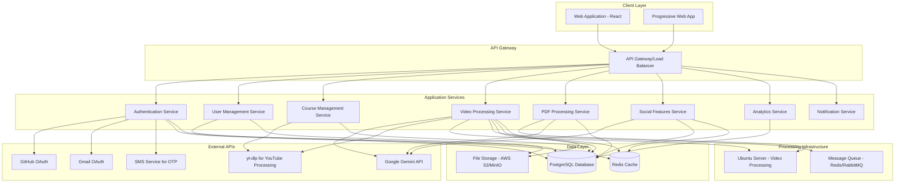

# Design Document

## Overview

Youtubera is a full-stack web application that converts multiple content types (YouTube videos, uploaded videos, and PDF textbooks) into structured learning experiences. The platform combines video processing, document processing, learning management, social networking, and gamification features to create an engaging educational environment. The architecture follows a microservices approach with a React frontend, Node.js/Express backend, PostgreSQL database, and Ubuntu server infrastructure for content processing.

## Architecture

### High-Level Architecture



### Technology Stack

**Framework Choice: Remix over Next.js**

Remix is chosen over Next.js for Youtubera because:
- **Data-heavy application**: Better handling of course data, progress tracking, and user interactions
- **File uploads**: Superior form handling for video and PDF uploads
- **Real-time features**: Easier WebSocket integration for live chat and synchronized video watching
- **Progressive enhancement**: Better performance for users with slower connections (important for video content)
- **Error handling**: Built-in error boundaries for video processing failures
- **Simpler data flow**: No need for complex client-side state management

**Frontend:**
- React 18 with TypeScript
- Remix for full-stack framework with SSR and routing
- Tailwind CSS for styling with light/dark mode support
- Vidstack.io for advanced video player functionality
- Built-in Remix data loading and mutations
- Socket.io client for real-time features
- PatternCraft backgrounds for premium visual design
- UXWing icons for consistent iconography

**Backend:**
- Remix full-stack with Node.js runtime
- TypeScript for type safety
- Session-based authentication (Remix built-in)
- Socket.io for real-time communication
- Bull Queue for job processing
- Express.js for additional API routes if needed

**Database:**
- PostgreSQL for primary data storage
- Redis for caching and session management
- Prisma ORM for database operations

**Infrastructure:**
- Ubuntu server for video processing
- Local environment for PDF processing (Node.js runtime)
- yt-dlp for YouTube video downloading and metadata extraction
- FFmpeg for video manipulation and optimization
- PDF processing libraries (pdf2pic, pdf-parse) running in Node.js
- Docker for containerization
- Nginx for reverse proxy

**Development Tools:**
- Storybook.js for UI component development and documentation
- Cypress.io for end-to-end testing
- Jest for unit testing
- Treblle-inspired scrolling effects for premium UX

## Components and Interfaces

### 1. Authentication Service

**Responsibilities:**
- Handle multiple authentication methods (GitHub, Gmail, standard)
- JWT token management
- Role-based access control (learner, YouTuber, admin)
- OTP verification for YouTubers

**Key Interfaces:**
```typescript
interface AuthService {
  login(credentials: LoginCredentials): Promise<AuthResponse>
  register(userData: RegisterData): Promise<AuthResponse>
  verifyOTP(phone: string, otp: string): Promise<boolean>
  refreshToken(token: string): Promise<string>
  logout(userId: string): Promise<void>
}

interface User {
  id: string
  username: string
  email: string
  role: 'learner' | 'youtuber' | 'admin'
  isVerified: boolean
  profilePicture?: string
  bio?: string
  githubId?: string
  googleId?: string
  phone?: string
  createdAt: Date
}
```

### 2. Course Management Service

**Responsibilities:**
- YouTube playlist/video processing
- Uploaded video processing
- PDF textbook processing
- Course structure creation
- Chapter and content segment management
- Progress tracking across multiple content types

**Key Interfaces:**
```typescript
interface CourseService {
  createCourseFromPlaylist(playlistUrl: string, userId: string): Promise<Course>
  createCourseFromVideo(videoUrl: string, userId: string): Promise<Course>
  createCourseFromUploadedVideo(videoFile: File, userId: string): Promise<Course>
  createCourseFromPDF(pdfFile: File | string, userId: string): Promise<Course>
  getCourse(courseId: string): Promise<Course>
  updateProgress(userId: string, contentId: string, progress: number): Promise<void>
  downloadShortVideo(videoId: string, userId: string): Promise<string>
}

interface Course {
  id: string
  title: string
  description: string
  contentType: 'youtube_playlist' | 'youtube_video' | 'uploaded_video' | 'pdf_textbook'
  youtuberName?: string
  channelName?: string
  authorName?: string
  thumbnailUrl: string
  totalDuration?: number
  totalPages?: number
  chapters: Chapter[]
  createdAt: Date
}

interface Chapter {
  id: string
  title: string
  originalContentId: string
  contentType: 'video' | 'pdf'
  shortVideos?: ShortVideo[]
  textSections?: TextSection[]
  exercises: Exercise[]
  quiz?: Quiz
}

interface ShortVideo {
  id: string
  title: string
  duration: number
  videoUrl: string
  downloadUrl: string
  thumbnailUrl: string
  startTime: number
  endTime: number
  processingType: 'ai' | 'chapter' | 'custom'
  customQuery?: string
}

interface TextSection {
  id: string
  title: string
  content: string
  pageNumbers: number[]
  processingType: 'ai'
}
```

### 3. Video Processing Service

**Responsibilities:**
- YouTube video download using yt-dlp (more reliable than YouTube API)
- Uploaded video processing
- AI-based video segmentation
- Chapter-based video splitting using yt-dlp metadata
- Custom query-based video segmentation
- Video optimization and compression
- Video download preparation

**Key Interfaces:**
```typescript
interface VideoProcessingService {
  downloadYouTubeVideo(url: string): Promise<VideoDownloadResult>
  processVideo(videoSource: string | File, processingType: 'ai' | 'chapter' | 'custom', customQuery?: string): Promise<ProcessingJob>
  extractVideoMetadata(videoPath: string): Promise<VideoMetadata>
  getVideoChapters(videoPath: string): Promise<Chapter[]>
  generateAISegments(videoPath: string): Promise<VideoSegment[]>
  generateCustomSegments(videoPath: string, query: string): Promise<VideoSegment[]>
  optimizeVideo(inputPath: string, outputPath: string): Promise<string>
  prepareVideoDownload(videoId: string): Promise<string>
}

interface VideoDownloadResult {
  videoPath: string
  metadata: VideoMetadata
  chapters?: ChapterInfo[]
}

interface VideoMetadata {
  title: string
  description: string
  duration: number
  uploader: string
  uploadDate: string
  thumbnailUrl: string
}

interface ProcessingJob {
  id: string
  status: 'pending' | 'processing' | 'completed' | 'failed'
  progress: number
  videoSource: string
  processingType: 'ai' | 'chapter' | 'custom'
  customQuery?: string
  result?: ProcessedVideo
}

interface VideoSegment {
  startTime: number
  endTime: number
  title: string
  description?: string
  relevanceScore?: number
}
```

### 4. PDF Processing Service

**Responsibilities:**
- PDF upload and parsing (processed in Node.js runtime, not Ubuntu server)
- Text extraction and content analysis
- AI-based chapter/section identification using Gemini API
- Topic-based content segmentation
- Reading progress tracking
- PDF image extraction and optimization

**Key Interfaces:**
```typescript
interface PDFProcessingService {
  processPDF(pdfSource: File | string): Promise<PDFProcessingJob>
  extractText(pdfPath: string): Promise<string>
  extractImages(pdfPath: string): Promise<string[]>
  generateChapters(textContent: string): Promise<TextChapter[]>
  generateSections(chapterContent: string): Promise<TextSection[]>
  optimizePDFImages(pdfPath: string): Promise<string[]>
}

interface PDFProcessingJob {
  id: string
  status: 'pending' | 'processing' | 'completed' | 'failed'
  progress: number
  pdfSource: string
  result?: ProcessedPDF
}

interface ProcessedPDF {
  id: string
  title: string
  author: string
  totalPages: number
  chapters: TextChapter[]
  thumbnailUrl: string
}

interface TextChapter {
  id: string
  title: string
  pageStart: number
  pageEnd: number
  sections: TextSection[]
}
```

### 5. Social Features Service

**Responsibilities:**
- Community interactions
- Private messaging with E2E encryption
- Following/followers system
- Content moderation using Gemini API

**Key Interfaces:**
```typescript
interface SocialService {
  createPost(userId: string, content: string, courseId: string): Promise<Post>
  getCourseCommunity(courseId: string): Promise<Post[]>
  followUser(followerId: string, followeeId: string): Promise<void>
  sendPrivateMessage(senderId: string, receiverId: string, message: string): Promise<void>
  moderateContent(content: string): Promise<ModerationResult>
}

interface Post {
  id: string
  userId: string
  courseId: string
  content: string
  replies: Reply[]
  createdAt: Date
  isModerated: boolean
}

interface PrivateMessage {
  id: string
  senderId: string
  receiverId: string
  content: string
  isEncrypted: boolean
  timestamp: Date
}
```

### 6. Analytics Service

**Responsibilities:**
- Learning progress tracking
- Streak calculation
- Skill tag generation
- Certificate creation

**Key Interfaces:**
```typescript
interface AnalyticsService {
  updateLearningProgress(userId: string, activity: LearningActivity): Promise<void>
  calculateStreak(userId: string): Promise<StreakData>
  generateSkillTags(userId: string): Promise<SkillTag[]>
  createCertificate(userId: string, courseId: string): Promise<Certificate>
}

interface LearningActivity {
  type: 'video_watched' | 'exercise_completed' | 'post_created'
  courseId: string
  points: number
  timestamp: Date
}

interface StreakData {
  currentStreak: number
  longestStreak: number
  totalActiveDays: number
  lastActivityDate: Date
}

interface SkillTag {
  name: string
  percentage: number
  coursesCompleted: number
}
```

## Data Models

### Database Schema

```sql
-- Users table
CREATE TABLE users (
  id UUID PRIMARY KEY DEFAULT gen_random_uuid(),
  username VARCHAR(50) UNIQUE NOT NULL,
  email VARCHAR(255) UNIQUE NOT NULL,
  password_hash VARCHAR(255),
  role VARCHAR(20) DEFAULT 'learner',
  is_verified BOOLEAN DEFAULT false,
  profile_picture TEXT,
  bio TEXT,
  github_id VARCHAR(100),
  google_id VARCHAR(100),
  phone VARCHAR(20),
  is_profile_public BOOLEAN DEFAULT true,
  created_at TIMESTAMP DEFAULT CURRENT_TIMESTAMP,
  updated_at TIMESTAMP DEFAULT CURRENT_TIMESTAMP
);

-- Courses table
CREATE TABLE courses (
  id UUID PRIMARY KEY DEFAULT gen_random_uuid(),
  title VARCHAR(255) NOT NULL,
  description TEXT,
  content_type VARCHAR(50) NOT NULL, -- 'youtube_playlist', 'youtube_video', 'uploaded_video', 'pdf_textbook'
  youtuber_name VARCHAR(255),
  channel_name VARCHAR(255),
  author_name VARCHAR(255),
  thumbnail_url TEXT,
  source_url TEXT, -- YouTube URL or PDF URL
  file_path TEXT, -- For uploaded files
  total_duration INTEGER, -- For video content
  total_pages INTEGER, -- For PDF content
  created_by UUID REFERENCES users(id),
  created_at TIMESTAMP DEFAULT CURRENT_TIMESTAMP
);

-- Chapters table
CREATE TABLE chapters (
  id UUID PRIMARY KEY DEFAULT gen_random_uuid(),
  course_id UUID REFERENCES courses(id) ON DELETE CASCADE,
  title VARCHAR(255) NOT NULL,
  content_type VARCHAR(20) NOT NULL, -- 'video' or 'pdf'
  original_content_id VARCHAR(100), -- Video ID or PDF section ID
  page_start INTEGER, -- For PDF chapters
  page_end INTEGER, -- For PDF chapters
  order_index INTEGER,
  created_at TIMESTAMP DEFAULT CURRENT_TIMESTAMP
);

-- Short videos table
CREATE TABLE short_videos (
  id UUID PRIMARY KEY DEFAULT gen_random_uuid(),
  chapter_id UUID REFERENCES chapters(id) ON DELETE CASCADE,
  title VARCHAR(255) NOT NULL,
  duration INTEGER,
  video_url TEXT NOT NULL,
  download_url TEXT, -- For downloadable videos
  thumbnail_url TEXT,
  start_time INTEGER,
  end_time INTEGER,
  processing_type VARCHAR(20), -- 'ai', 'chapter', 'custom'
  custom_query TEXT, -- For custom processing
  relevance_score DECIMAL(3,2), -- For custom processing
  order_index INTEGER,
  created_at TIMESTAMP DEFAULT CURRENT_TIMESTAMP
);

-- Text sections table (for PDF content)
CREATE TABLE text_sections (
  id UUID PRIMARY KEY DEFAULT gen_random_uuid(),
  chapter_id UUID REFERENCES chapters(id) ON DELETE CASCADE,
  title VARCHAR(255) NOT NULL,
  content TEXT NOT NULL,
  page_numbers INTEGER[], -- Array of page numbers
  processing_type VARCHAR(20) DEFAULT 'ai',
  order_index INTEGER,
  created_at TIMESTAMP DEFAULT CURRENT_TIMESTAMP
);

-- User progress table (unified for videos and text)
CREATE TABLE user_progress (
  id UUID PRIMARY KEY DEFAULT gen_random_uuid(),
  user_id UUID REFERENCES users(id) ON DELETE CASCADE,
  content_id UUID NOT NULL, -- References short_videos.id or text_sections.id
  content_type VARCHAR(20) NOT NULL, -- 'video' or 'text'
  progress_value INTEGER DEFAULT 0, -- Seconds for video, percentage for text
  is_completed BOOLEAN DEFAULT false,
  processing_type VARCHAR(20),
  last_accessed TIMESTAMP DEFAULT CURRENT_TIMESTAMP,
  UNIQUE(user_id, content_id, content_type, processing_type)
);

-- Social features tables
CREATE TABLE follows (
  id UUID PRIMARY KEY DEFAULT gen_random_uuid(),
  follower_id UUID REFERENCES users(id) ON DELETE CASCADE,
  followee_id UUID REFERENCES users(id) ON DELETE CASCADE,
  created_at TIMESTAMP DEFAULT CURRENT_TIMESTAMP,
  UNIQUE(follower_id, followee_id)
);

CREATE TABLE posts (
  id UUID PRIMARY KEY DEFAULT gen_random_uuid(),
  user_id UUID REFERENCES users(id) ON DELETE CASCADE,
  course_id UUID REFERENCES courses(id) ON DELETE CASCADE,
  content TEXT NOT NULL,
  is_moderated BOOLEAN DEFAULT false,
  created_at TIMESTAMP DEFAULT CURRENT_TIMESTAMP
);

CREATE TABLE private_messages (
  id UUID PRIMARY KEY DEFAULT gen_random_uuid(),
  sender_id UUID REFERENCES users(id) ON DELETE CASCADE,
  receiver_id UUID REFERENCES users(id) ON DELETE CASCADE,
  content TEXT NOT NULL,
  is_encrypted BOOLEAN DEFAULT true,
  is_read BOOLEAN DEFAULT false,
  created_at TIMESTAMP DEFAULT CURRENT_TIMESTAMP
);

-- Analytics tables
CREATE TABLE learning_activities (
  id UUID PRIMARY KEY DEFAULT gen_random_uuid(),
  user_id UUID REFERENCES users(id) ON DELETE CASCADE,
  activity_type VARCHAR(50),
  course_id UUID REFERENCES courses(id),
  points INTEGER DEFAULT 0,
  created_at TIMESTAMP DEFAULT CURRENT_TIMESTAMP
);

CREATE TABLE certificates (
  id UUID PRIMARY KEY DEFAULT gen_random_uuid(),
  user_id UUID REFERENCES users(id) ON DELETE CASCADE,
  course_id UUID REFERENCES courses(id) ON DELETE CASCADE,
  certificate_url TEXT,
  issued_at TIMESTAMP DEFAULT CURRENT_TIMESTAMP
);
```

## Error Handling

### Error Categories

1. **Authentication Errors**
   - Invalid credentials
   - Expired tokens
   - Insufficient permissions

2. **Content Processing Errors**
   - Invalid YouTube URLs
   - Video upload failures
   - PDF parsing errors
   - Processing timeouts
   - Storage failures

3. **API Rate Limiting**
   - YouTube API limits
   - Gemini API limits
   - Internal rate limiting

4. **Validation Errors**
   - Invalid input data
   - Missing required fields
   - Data format errors

### Error Response Format

```typescript
interface ErrorResponse {
  error: {
    code: string
    message: string
    details?: any
    timestamp: string
  }
}
```

### Error Handling Strategy

- Implement circuit breakers for external API calls
- Use exponential backoff for retries
- Graceful degradation for non-critical features
- Comprehensive logging and monitoring
- User-friendly error messages

## Testing Strategy

### Unit Testing
- Jest for JavaScript/TypeScript testing
- 80%+ code coverage requirement
- Mock external dependencies
- Test all service methods and utilities

### Integration Testing
- Test API endpoints with Supertest
- Database integration tests with test containers
- External API integration tests with mocks

### End-to-End Testing
- Cypress.io for browser automation and user journey testing
- Critical user journey testing (course creation, video watching, social interactions)
- Cross-browser compatibility testing
- Mobile responsiveness testing
- Visual regression testing with Cypress

### Performance Testing
- Load testing with Artillery
- Video processing performance benchmarks
- Database query optimization testing
- API response time monitoring

### Security Testing
- Authentication flow testing
- Authorization boundary testing
- Input validation testing
- SQL injection prevention testing
- XSS prevention testing

### Testing Environment Setup
- Separate test databases
- Mock external services
- Automated CI/CD pipeline testing
- Staging environment validation